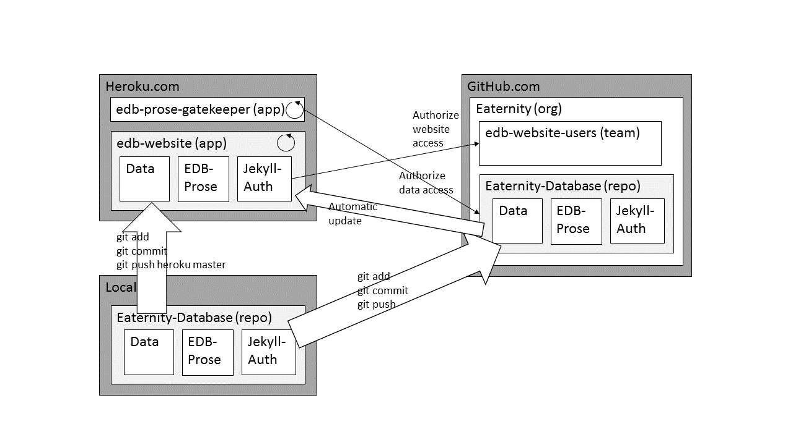

# Eaternity Database User Manual
Access to the current running instance of the Application can be found on [http://my-edb.herokuapp.com](http://my-edb.herokuapp.com). There are three tools available: [Products DB](http://my-edb.herokuapp.com/index-prod.html/), [Nutrition DB](http://my-edb.herokuapp.com/index-nutr.html) and [EDB-Prose](http://my-edb.herokuapp.com/prose/). How to work with the Eaternity database:
1. Make sure you have i) a GitHub account and ii) sufficient rights to access the data stored in in https://github.com/eaternity-agent/eaternity-database-public -> Master Branch -> <code>&#95;data/prods</code> or <code>&#95;data/nutrs</code> -> repository.
2. Open the [Jekyll-DB overview on all products/nutritions](http://my-edb.herokuapp.com/). You can search any text displayed on the page and sort by columns. Click on the product/nutrition you want to edit.
3. If you are already logged in with your GitHub account, the file is displayed as a form. If you are not yet logged in, a page will appear telling you to please _AUTHORIZE ON GITHUB_. You will be redirected to a GitHub page where you will be asked for your GitHub username and password. If you do not have sufficient rights to access the linked data, you will receive an error page telling you that there is no such resource/web page available.
4. Edit the data in the input form and save your data using the "Save" icon on the right. You will have to provide a short text explaining your changes before saving.

## Adding new products or nutrition files
1. Open [Prose.io](http://prose.io). If you are not yet logged in to your Github page, do it now.
2. Navigate to the repository (e.g. eaternity-database-public) where you want to add a file to. (There is a dropdown menu on the right upper side of the page where you can switch branches.)
3. Go to the <code>_data/prod</code> directory. You will see a list of all existing products.
4. Before you continue, decide which id you want to use for this product. The id should be a positive number not yet given to any other product. This is is an important step: Setting an invalid id can lead to a confusion between products.
5. Click on the <code>New File</code> button.
6. Set the filename according to this pattern: <code>&lt;id&gt;-&lt;name&gt;-prod.json</code>.
7. Delete all existing text from the file. Add this basic json code: <code>{ "id": &lt;id&gt;, "name": "&lt;name&gt;"</code>. Make sure you put the name in double quotes ("") but not the id.
8. On the right of the page, click the "Save" button. You will be asked to provide a short text explaining what you did. Confirm your changes and save.

# Eaternity Database Technical Documentation
The Eaternity Database is a collection of files and tools.
1. File Structure: Product and nutrition data is stored in SON data format in a [non-public GitHub repository](http://prose.io/#Eaternity/eaternity-database-public) in the master branch. There is one .json file per product/nutrition.
2. Jekyll-DB: [Jekyll-DB](https://github.com/rypan/jekyll-db) is used to display an overview of all ingredients to the user. The user can search for keywords and select the file to edit.
3. Prose: Data is edited in an adapted version of [Prose](http://prose.io/). Thus, the full advantage of GitHub's versioning system is offered to the users.

This is a schematic overview on the whole EDB solution:

There are three different physical locations involved: Heroku.com, GitHub.com und the local computer. Whereas the website's content is stored in a repository on GitHub.com at [https://github.com/Eaternity/eaternity-database-public](https://github.com/eaternity/eaternity-database-public), the website itself is hosted on and served from an app running at Heroku.com under the URL [https://my-edb.herokuapp.com](https://my-edb.herokuapp.com). When new changes are pushed to the repository on GitHub.com, the Jekyll server running at Heroku.com is automatically notified, the website is rebuilt and after a few minutes the changes are reflected to the user. The GitHub repository is private. GitHub's <code>gh-pages</code> branch is never used, because everything published under a <code>gh-pages</code> branch is accessible to the whole world. The repository belongs to a GitHub organization _Eaternity_. This organization has a team _edb-website-users_. All members of this team have admin access to the _eaternity-database-public_ repository, and only members of this team will be allowed to access the website and read or write data through it.

#### Workflow
The website including all files are stored in a GitHub repository available in the <code>master</code> branch. The website consists of three different sets of files - all more or less mingled together:

1. Data: Data is kept inside the <code>&#95;data/prod</code>, <code>&#95;data/nutr</code> etc. directories.
2. EDB Prose: EDB Prose is an adapted version of prose relying on JSONForm to display user forms. For more information, see further below. Although all the code is inside the repo's <code>prose</code> directory, the file <code>prose/index.html</code> expects a few other Javascript files to exist one level above it, i.e. in <code>prose/../..</code>.
3. Jekyll-Auth: Jekyll-Auth is used to control access to the website hosted on Heroku.

When  a user makes any changes to the local clone of the GitHub repository, he then adds <code>git add...</code>, commits <code>git commit -m "blah"</code> and pushes <code>git push</code> these changes to the remote GitHub repository. A webhook is available for the _eaternity-database-public_ repository, and it is through this webhook that the Jekyll server running on Heroku is informed about pending updates. The Heroku server process grabs the changed files from the GitHub repository and rebuilds the whole website. (The whole process usually takes several minutes.) This automatic deployment from GitHub's repo to Heroku's repo is set up using a [GitHub integration feature for Heroku apps](https://devcenter.heroku.com/articles/github-integration). To see the current settings, log in to the Heroku Dashboard as _dev@eaternity.ch_ and click on the _Deploy_ menu item. (The GitHub integration feature is currently in beta status. An older, but still working alternative would be to use [Heroku deployer](https://github.com/himynameisjonas/heroku-deployer/), but this is more difficult to set up).

The Heroku server process has its own Git repository available under <code>git@heroku.com:my-edb.git</code>, but this repository should not be pushed to with <code>git push heroku master</code> in most cases. The reason is that the corresponding "sibling" repository on GitHub _eaternity-database-public_ will of course *not*  be notified of any changes made to Heroku.

#### Authorization and Authentication
When a user tries to access the website available under [https://my-edb.herokuapp.com](https://my-edb.herokuapp.com) several things happen in sequence.

1. First, Jekyll-Auth running on Heroku tries to access a local session cookie on the user's computer. If there is no such session cookie, the user is forwarded to a GitHub website and asked to provide his GitHub username and password. Next, if never done before he must explicitly authorize the Heroku website process to access this repository on his behalf, i.e. using his username and password.
2. GitHub checks to see whether this user is a registered member of the team _edb-website-users_ or not and returns this information to the Heroku server process. If ok the requested web content is displayed to the user. If not ok then the user sees a 403.html "access denied" page (which may look different in different browsers). If someone forgot to add this user to _edb-website-users_, *the user _must_ first delete his cookies and close the browser down before attempting again to open the website - otherwise the authorization/authentication will fail again!*
3. The user now browses through the website's content. At one point, he clicks on a product file link, e.g. "1234-blah-prod.json". This link effectively resolves to an EDB Prose page, itself requesting access to the file <code>Eaternity/eaternity-database-public/&#95;data/prod/1234-bla-prod.json</code> in the GitHub repository. A second authorization/authentication is triggered at this step, which is independent of the first one performed earlier. Whereas through the first authorization/authentication procedure website access is controlled, the second controls access of the user to any data file on the GitHub repository through EDB Prose. Therefore, first the _edb-prose-gatekeeper_ app requests the user's credentials, which are by now probably stored locally in a session cookie. These credentials are sent to GitHub, and GitHub returns ok/nok for this user.
4. If ok, EDB Prose tries to load the requested data file in a _JSONForm_ form. The user makes changes through the form and finally submits the data to the GitHub repository through EDB Prose. This again notifies the _my-edb_ Jekyll server running on Heroku of changes, which ultimately leads to a website rebuild.

## 1. Repository File Structure
Every product is stored in the JSON data format in a file with a filename of <code>&lt;id&gt;-&lt;product-name&gt;-prod.json</code>. For nutrition files the filename is <code>&lt;id&gt;-&lt;nutrition-name&gt;-nutr.json</code>.
All files are placed in a <code>_data/prods/</code> resp. <code>_data/nutr/</code> subdirectory in the gh-pages branch of the project. All YAML- or JSON-files placed in such a subdirectory can be accessed and looped over via Liquid templates: 

<code> ...do something... </code>.

The variable <code>prod[0]</code> will contain the filename (without leading path and without file ending), whereas <code>prod[1]</code> will contain the key/value-pairs specified in YAML or JSON.

It is now easy to build a HTML page containing a list of all ingredients with selected attributes:    
```
...  
<ul>
  
  <li>Filename: {{ prod[0] }}.json; name: {{ prod[1].name }}</li>  
  
</ul>  
...
```

## 2. Jekyll-DB
[Jekyll-DB](https://github.com/rypan/jekyll-db) is an open source and easy-to-use tool based on [List.js](http://listjs.com/) to index, filter, search, sort and display html tables and lists. Basically, Jekyll-DB always processes a file's frontmatter, which might be prepended in either YAML or JSON format. The file itself must be in the <code>_posts</code> (or <code>_data</code>) directory and be recognized by Jekyll as a valid post, i.e. it must have a valid file ending for markdown (.md, .markdown) or html (.html, .htm) posts. From a file's frontmatter, Jekyll-DB builds an adaptable display table that can be searched and filtered by keywords and sorted by columns. It is also possible to place links in the display table e.g. to a open a given post item in a GitHub or Prose editor. Data columns can be specified, as can the number of displayed items. (This feature requires Jekyll-DB > v2.1.0.)

Although the official documentation does not state it explicitly, Jekyll-DB not only works with YAML/JSON-frontmatter of files placed inside a <code>_posts</code> directory, but also with YAML/JSON-files in a <code>_data/prods/</code> (or <code>_data/nutrs/</code>) subdirectory. If a <code>_posts/</code> directory is used, in Liquid templates frontmatter data can be accessed directly, e.g. <code> ...{{ post.myFrontmatterKey }}... </code>. For <code>_data/prods/</code> subdirectories, additionally indices must be used to differentiate between filename at index 0 and frontmatter content at index 1: <code> ...{{ edb[1].myFrontmatterKey }}... </code>.

If JSON files inside a <code>_data</code> subdirectory should be indexed, a Jekyll server instance >= v.2.1.0 is required. Indexing frontmatter only in a <code>_posts</code> directory also works with older Jekyll server instances. Re-indexing all -prod.json files on Github can take 30 seconds to a few minutes.

#### Adding or removing columns
To add new columns or remove existing ones, follow the steps [described in Jekyll-DB's README file](https://github.com/rypan/jekyll-db/blob/gh-pages/README.md).

## 3. EDB Prose
Whereas Jekyll-DB allows to display data, [Prose](http://prose.io/) can be used to actually edit the underlying data. Prose is an open-source editor built on top of GitHub pages. There is a free-to-use online instance running at the given link, but it is also possible to run one's own Prose in any YAML-aware webserver such as Jekyll or a [Node.js](http://nodejs.org/) web server.
We use an adapted version of prose which additionally supports files with file names ending on <code>-prod.json</code> or <code>-nutr.json</code>. Such files are expected to be in the EDB JSON data format. Opening such a file in the adapted version of Prose will automatically open a [JSONForm](https://github.com/joshfire/jsonform) editor window.

### Installation manual for Prose
A user must be able to authorise access of Prose (or any descendant) to his/her Github repositories. For this purpose, besides installing and running Prose, also a gatekeeper server must be installed and run on Heroku. The basic steps are:

#### Step 1: Register GitHub application
GitHub applications such as Prose need to follow the OAuth procedure for authentication. Thus, we need to [register a new OAuth application on GitHub](https://github.com/settings/applications/new). As a result, we will receive a clientId (e.g. da429541964e3302c62f) and a client secret (another string consisting of random numbers and letters). This is the information which will be required by the gatekeeper instance.

#### Step 2: Create Heroku account
In the case of Prose, a dedicated gatekeeper server is needed for the OAuth procedure with GitHub to work. This server is neither provided by GitHub nor can it be run on GitHub and therefore must be set up manually externally. For this purpose, we need a (free) repository on [Heroku](http://www.heroku.com), there we will run our own gatekeeper server. We register a new account at [Heroku](http://www.heroku.com). At this time, there is no need to set up a sample application.

#### Step 3: Install and run Prose gatekeeper server on Heroku

Next, we need to install our own gatekeeper server on Heroku. The installation steps are described in [Prose's documentation on Gatekeeper](https://github.com/prose/gatekeeper). Here they are:  
1. Clone the gatekeeper server repository:  
<code>git clone git@github.com:prose/gatekeeper.git</code>  
2. Install the dependencies:
<code>cd gatekeeper && npm install</code>  
3. (Hint: We will not use <code>cake</code>, therefore this step can be skipped. Nevertheless, here's an up-to-date version of how the config.json file should look like.)
<code>
{  
  "oauth_client_id": "da429541964e3302c62f",  
  "oauth_client_secret": "XXX",  
  "oauth_host": "github.com",  
  "oauth_port": 443,  
  "oauth_path": "/login/oauth/access_token",  
  "oauth_method": "POST"  
}  
</code>
We do not want to run the gatekeeper server locally and directly continue to the deployment on Heroku.  
4. Because we are not going to use [coffescript's cake command](http://coffeescript.org/) command, the next steps slightly deviate from Prose's instructions. Make sure you are in your local gatekeeper directory:
``` 
gatekeeper> heroku create  
gatekeeper> heroku apps:rename my-edb-prose-gatekeeper  
gatekeeper> heroku config:set OAUTH_CLIENT_ID=da429541964e3302c62f OAUTH_CLIENT_SECRET=XXX  
gatekeeper> git push heroku master  
```
In our case, we chose to use the name "my-edb-prose-gatekeeper" for our application, which will result in an url of http://my-edb-prose-gatekeeper.herokuapp.com. The client secret will not bo provided here but must be taken from GitHub's application registration procedure. The gatekeeper server should now be up and running. This can be checked in our Heroku account.

#### Step 5: Prepare and push Prose to the GitHub repository, project and branch
We are now ready to rebuild our adapted version of Prose, so that authorisation through gatekeeper runs smoothly.  
1. For this purpose, we need to adapt the file oauth.json:
```  
{  
  "api": "https://api.github.com",  
  "site": "https://github.com",  
  "clientId": "da429541964e3302c62f",  
  "gatekeeperUrl": "https://my-edb-prose-gatekeeper.herokuapp.com"  
}  
```
Once we've made our changes, we rebuild prose.js/prose.min.js with the commands <code>make clean</code> and <code>make</code>. Note that the file oauth.json is added to <code>.gitignore</code> and will not be uploaded to the server. Instead, during the build process the file's contents are read out and appended to prose.js/prose.min.js. (Attention: Using the make command in Windows is cumbersome, as this presumes an installation of a make-tool, e.g. the one provided by [cygwin](https://www.cygwin.com/). After installation, the make commands must be run manually. Still this somehow results in problems, because after these steps the modified Prose cannot be started with <code>jekyll serve</code> anymore, but only with npm's <code>serve</code> command. If using Jekyll, an error message is thrown: _jekyll 2.1.0 | Error: undefined method 'default_proc=' for "this --- is correct":String_.)  
2. Finally, we commit & push our adapted version of Prose to the gh-pages branch of our project repository (http://eaternity-agent.github.io/Eaternity-Datenbank/). We need to wait a few minutes until GitHub's Jekyll server is ready to serve our version of Prose under the url http://my-edb.herokuapp.com/.
3. 

## 4. Adding a new data type to Prose and JSONForm
Adding a new data type (e.g. _-proc.json_) to Prose and JSONForm requires the manipulation of several files. After the manipulation, Prose must be rebuilt using a make command.

#### Step 1: Extending Prose's functionality
Manipulation of Prose requires the adaptation of 4 files:  

* <code>eaternity-database-public/prose/app/util.js</code>: Recognizes data files by their endings. All we add is an <code>isProc</code> function comparable to the already existing <code>isProd</code> and <code>isNutr</code> functions.
* <code>eaternity-database-public/prose/app/models/file.js</code>: Inside the <code>initialize</code> function we have to register the statement <code>'proc': util.isProc(path),</code>.
* <code>eaternity-database-public/prose/app/views/file.js</code>: Inside the <code>initEditor</code> function we have to specify to open the JSONForm editor instead of the default editor for <code>-proc.json</code> files. Inside the <code>render</code> function, the <code>edit</code> function and the <code>showDiff</code> function we add some statements for the new _proc_ files.
* <code>eaternity-database-public/prose/app/views/jsonformformat.js</code>: We need to add a schema- and form-definition as specified in the JSONForm docs.

In case you would like to create dropdown menus in JSONForm, you will probably have to set up additional Javascript files similar to <code>id-prod.js</code> and <code>id-nutr.js</code>. Do not forget to import these Javascript files in <code>Eaternity-Datenbank/prose/index.html</code>. You can then refer to the list of product ids, nutrition ids or process ids inside the _jsonformformat.js_ file as *ID_PROD*, *ID_NUTR* or *ID_PROC*.

#### Step 2: Rebuilding Prose
We have made changes to Prose, thus we need to rebuild it. For this purpose, the <code>make</code> tool is required. Unfortunately, installing _make_ on a Windows machine is quite a pain, and I don't recommend it. Hint: There might exist an alternative to the _make_ command now using [_gulp_](https://github.com/gulpjs/gulp/).

1. Make sure you are located inside the <code>eaternity-database-public/prose</code> directory and that <code>make</code> is in your path. Call <code>make clean</code> to clean up first.
2. Call <code>make</code> to rebuild Prose. There might be warnings, but there should not be an error.
 
#### Step 3: Adding data
Inside the <code>_data</code> directory, create a new subdirectory, e.g. <code>_data/procs</code>. Therein create a first test file, e.g. _-1-test-proc.json_. Add, commit and push the data files to the remote GitHub repository.

#### Step 4: Testing the input form locally
Before we push our changes to the server, we would like to try out the new input forms locally. Once we pushed our changes to the server, the new file will be available under the link *http://github.com/prose/#Eaternity/eaternity-database-public/edit/gh-pages/_data/proc/-1-test-proc.json*. Until then accessing the newly created data files will run through a local Jekyll server instance, thus the link is *http://localhost:4000/prose/#Eaternity/eaternity-database-public/edit/gh-pages/_data/proc/-1-test-proc.json*.

#### Step 5: Setting up Jekyll-DB
Next, we want to set up everything in order to present a [Jekyll-DB](https://github.com/rypan/jekyll-db) overview page to the user. The set up is fairly simple.

1. _cd_ into your *_includes* directory. Create a copy of one of the existing files _interactive-table-prod.html_  or _interactive-table-nutr.html_ and name it _interactive-tale-proc.html_. Edit the HTML table inside this file to contain all the columns for Jekyll-DB to display, including the file link inside the HTML anchor tag. Also don't forget to adjust the <code>valueNames</code> variable inside the <code>option</code> Javascript object at the bottom of the file. Save and exit.
2. _cd_ back into _eaternity-database-public_'s root. Create a copy of one of the existing files _index-prod.html_ or _index-nutr.html_. In the file, replace all occurrences of _prod_ or _nutr_ with _proc_. Save and exit.
3. Still in the root directory, create a copy of either _output-prod.json_ or _output-nutr.json_ and name it _output-proc.json_. The file must match the changes made in _interactive-table-proc.html_. Save and exit.
4. If you want, you can also adjust the root directory's index.html file.

Now, if you restart the local Jekyll server with <code>jekyll serve --host localhost</code> the whole site is rebuilt. This might take a while. The new website is available at http://localhost:4000/index-proc.html resp. will be available at http://my-edb.herokuapp.com/index-proc.html respectively. Add, commit and push your changes to the remote GitHub repository and wait for the site to be rebuilt.

## 5. Installation of Jekyll-Auth
A complete installation guide to Jekyll-Auth can be found here: [http://fabian-kostadinov.github.io/2014/11/13/installation-of-jekyll-auth/](http://fabian-kostadinov.github.io/2014/11/13/installation-of-jekyll-auth/).
